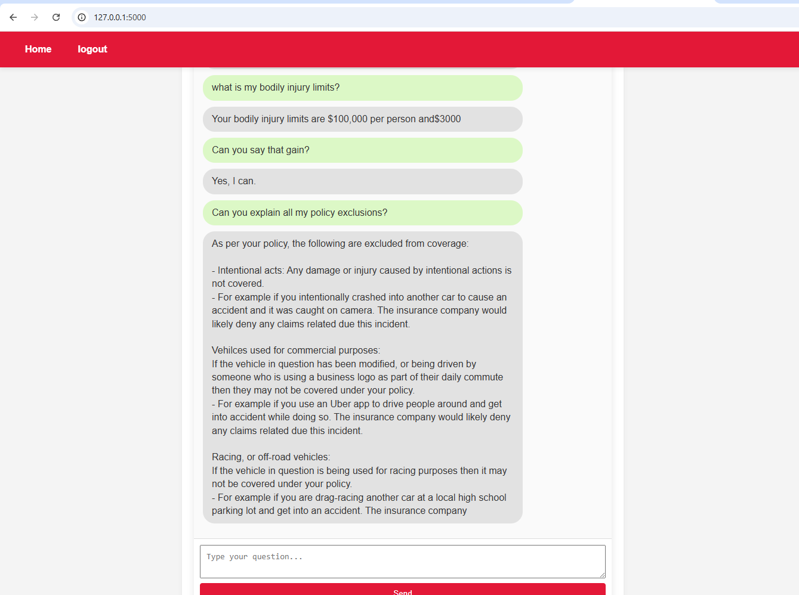

# 🧠 Flask AI ChatBot Web App

A simple web-based chatbot interface built with **Flask** and **vanilla JavaScript**, styled to resemble a messaging app. It accepts a **question** and **context**, sends it to a Flask backend via POST, and displays the response in a chat bubble UI.

---

## 📸 Screenshot




---

## 🚀 Features

- Chat-style front-end with user and bot messages  
- Accepts a question + context  
- Sends POST request to `/chat` endpoint  
- Displays chatbot response dynamically  
- Fully responsive and minimal styling (no frameworks)

---

## 🛠️ Requirements

Note: all the links are for windows systems

- Python 3.14+
- [Cmake](https://github.com/Kitware/CMake/releases/download/v4.1.2/cmake-4.1.2-windows-x86_64.msi)
- [C++](https://aka.ms/vs/17/release/vc_redist.x64.exe) redistributable from visial studio

### 🔧 Install Dependencies

```bash
pip install -r requirements.txt
```

---

## ▶️ How to Run

1. Clone the repository or copy the files into a directory.
2. Create a virtual environment

```bash
python -m venv venv
```

3. install dependencies

```bash
pip install -r requirements.txt
```

4. Download LLM [Model](https://huggingface.co/Raj-Maharajwala/OpenInsuranceLLM-Llama3-8B-GGUF/resolve/main/openinsurancellm-llama3-8b.Q4_K_M.gguf?download=true)
5. Store Model in directory 'gguf_dir' as 'open-insurance-llm-q4_k_m.gguf'

6. Run the Flask app:

```bash
python app/main.py
```

7. Open your browser and go to:

```
http://127.0.0.1:5000/
```

8. Start chatting with the bot!


---

## ✏️ Example POST Request

```json
{
  "question": "Does my insurance cover rental cars after an accident?",
  "context": "I was in a car accident last week and my vehicle is being repaired. I have comprehensive coverage with XYZ Insurance."
}
```

Response:

```json
{
  "answer": "You asked: 'Does my insurance cover rental cars after an accident?'. Based on the context: 'I was in a car accident last week and my vehicle is being repaired. I have comprehensive coverage with XYZ Insurance.', the answer is likely related to rental reimbursement under your policy."
}
```


---

## 📄 License

MIT License — feel free to use, modify, and share!
